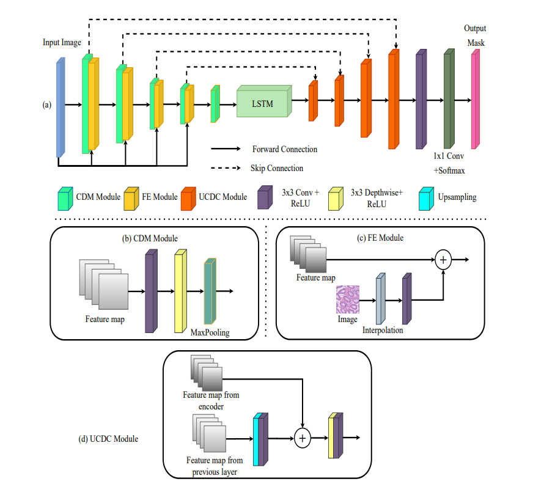
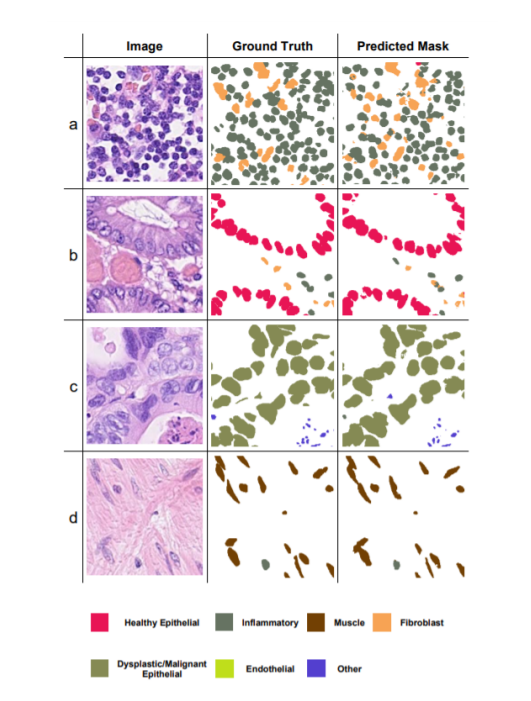

# FEEDNeT-A-Feature-Enhanced-Encoder-Decoder-LSTM-Network-for-Nuclei-Instance-Segmentation
This paper first introduces a novel model, named FEEDNet, for accurately segmenting the nuclei in HE stained WSIs. FEEDNet is an encoder-decoder network that uses LSTM units and “feature enhancement blocks” (FE-blocks). Our proposed FE-block avoids the loss of location information incurred by pooling layers by concatenating the downsampled version of the original image to preserve pixel intensities. FEEDNet uses an LSTM unit to capture multi-channel representations compactly

Fig Multi-class segmentation results on CoNSeP dataset. First column: original patch images. Second column:
the corresponding ground-truth patch mask. Third column: FEEDNet predicted mask. The four rows represent four
classes, viz. (a) Inflammatory, Fibroblast (b) Healthy Epithellial, Fibroblast, Inflammatory (c) Dysplastic/Malignant
Epithellial (d) Muscle, Inflammatory

